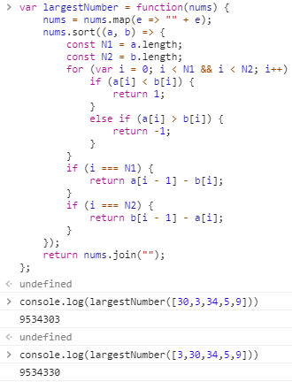
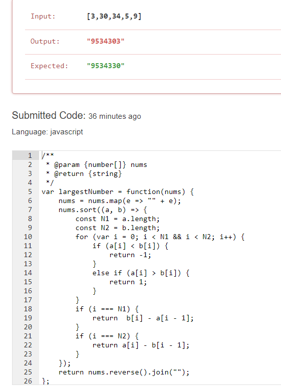
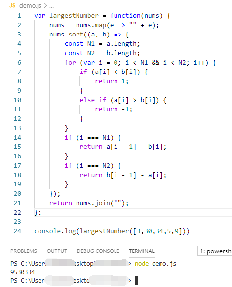

# 152. Maximum Product Subarray

Given an integer array `nums`, find the contiguous subarray within an array (containing at least one number) which has the largest product.

**Example 1:**

```
Input: [2,3,-2,4]
Output: 6
Explanation: [2,3] has the largest product 6.
```

**Example 2:**

```
Input: [-2,0,-1]
Output: 0
Explanation: The result cannot be 2, because [-2,-1] is not a subarray.
```

##### 2019.09.02

##### 我的思路：

##### 		方法1：

​		首先一发暴力遍历，时间复杂度O(n<sup>2</sup>)

```javascript
var maxProduct = function(nums) {
    if (!nums || nums.length == 0) {
        return;
    }
    let result = -Infinity;
    const N = nums.length;
    for (let i = 0; i < N; i++) {
        let tmp = 1;
        for (let j = i; j < N; j++) {
            tmp *= nums[j];
            result = Math.max(result, tmp);
        }
    }
    return result;
};
```

##### 		方法2：

​		O(n<sup>2</sup>)版的dp，我的思路依次计算1项、2项、...n项连乘积的最大值。但其实这个思路还是蛮垃圾的。

```javascript
var maxProduct = function(nums) {
    const N = nums.length;
    let dp = Array.from(nums);
    let result = Math.max(...nums);
    for (let i = 1; i < N; i++) {
        for (let j = 0; j + i < N; j++) {
            dp[j] = nums[j] * dp[j + 1];
            result = Math.max(result, dp[j]);
        }
    }
    return result;
}
```

##### 别人的写法:

​		O(n)的dp。这题的关键是递推方程里面当前的最大值，应该是当前值，最大值 * 当前值， 最小值 *当前值，这三者中得出。所以需要两个dp数组，一个存储到此最大值，一个存储最小值。又由于dp数组只和前一项有关，所以直接用max和min区分。

```javascript
var maxProduct = function(nums) {
    let result = nums[0];
    let max = result;
    let min = result;
    const N = nums.length;
    for (let i = 1; i < N; i++) {
        let tmp1 = max * nums[i];
        let tmp2 = min * nums[i];
        max = Math.max(...[nums[i], tmp1, tmp2]);
        min = Math.min(...[nums[i], tmp1, tmp2]);
        result = Math.max(result, max);
    }
    return result;
}
```

# 155. Min Stack

Design a stack that supports push, pop, top, and retrieving the minimum element in constant time.

- push(x) -- Push element x onto stack.
- pop() -- Removes the element on top of the stack.
- top() -- Get the top element.
- getMin() -- Retrieve the minimum element in the stack.

 

**Example:**

```
MinStack minStack = new MinStack();
minStack.push(-2);
minStack.push(0);
minStack.push(-3);
minStack.getMin();   --> Returns -3.
minStack.pop();
minStack.top();      --> Returns 0.
minStack.getMin();   --> Returns -2.
```

##### 2019.09.02

##### 我的思路：

​		每次入栈的时候除了当前值以外，接着再推一个当前最小值入栈。

```javascript
var MinStack = function() {
    this.stack = [];
};

/** 
 * @param {number} x
 * @return {void}
 */
MinStack.prototype.push = function(x) {
    let len = this.stack.length;
    if (!len) {
        this.stack.push(x);
        this.stack.push(x);
    }
    else {
        let preMin = this.stack[len - 1];
        this.stack.push(x);
        if (preMin < x) {
            this.stack.push(preMin);
        }
        else {
            this.stack.push(x);
        }
    }
    return;
};

/**
 * @return {void}
 */
MinStack.prototype.pop = function() {
    if (this.stack.length) {
        this.stack.pop();
        this.stack.pop();
    }
};

/**
 * @return {number}
 */
MinStack.prototype.top = function() {
    if (this.stack.length) {
        return this.stack[this.stack.length - 2];
    }
};

/**
 * @return {number}
 */
MinStack.prototype.getMin = function() {
    return this.stack[this.stack.length - 1];
};
```

##### 别人的写法:

​		存的是与最小值的差值，并且其中有几处精妙的地方，如push方法中else分支改变最小值、top方法中的else分支。神仙打架！

```javascript
var MinStack = function() {
    this.stack = [];
    this.min = Infinity;
};

/** 
 * @param {number} x
 * @return {void}
 */
MinStack.prototype.push = function(x) {
    if (!this.stack.length) {
        this.stack.push(0);
        this.min = x;
    }
    else {
        this.stack.push(x - this.min);
        if (x < this.min) {
            this.min = x;
        }
    }
};

/**
 * @return {void}
 */
MinStack.prototype.pop = function() {
    if (this.stack.length) {
        let pop = this.stack.pop();
        if (pop < 0) {
            this.min = this.min - pop;
        }
    }
};

/**
 * @return {number}
 */
MinStack.prototype.top = function() {
    let top = this.stack[this.stack.length - 1];
    if (top > 0) {
        return top + this.min;
    }
    else {
        return this.min;
    }
};

/**
 * @return {number}
 */
MinStack.prototype.getMin = function() {
    return this.min;
};
```

# 162. Find Peak Element

A peak element is an element that is greater than its neighbors.

Given an input array `nums`, where `nums[i] ≠ nums[i+1]`, find a peak element and return its index.

The array may contain multiple peaks, in that case return the index to any one of the peaks is fine.

You may imagine that `nums[-1] = nums[n] = -∞`.

**Example 1:**

```
Input: nums = [1,2,3,1]
Output: 2
Explanation: 3 is a peak element and your function should return the index number 2.
```

**Example 2:**

```
Input: nums = [1,2,1,3,5,6,4]
Output: 1 or 5 
Explanation: Your function can return either index number 1 where the peak element is 2, 
             or index number 5 where the peak element is 6.
```

**Note:**

Your solution should be in logarithmic complexity.

##### 2019.09.02

##### 我的思路：

​		蠢蠢的遍历

```javascript
var findPeakElement = function(nums) {
    nums.unshift(-Infinity);
    nums.push(-Infinity);
    const N = nums.length;
    for (let i = 1; i < N - 1; i++) {
        if (nums[i] > nums[i - 1] && nums[i] > nums[i + 1]) {
            return i - 1;
        }
    }
    return;
};
```

##### 别人的写法:

##### 方法1：优美的暴力遍历

​		这是由于题目要求说的边界为负无穷，所以找到第一个非递增的点，它的前一项就是局部顶点。

```javascript
var findPeakElement = function(nums) {
    const N = nums.length;
    for (let i = 1; i < N; i++) {
        if (nums[i] < nums[i - 1]) {
            return i - 1;
        }
    }
    return N - 1;
}
```

##### 方法2：二分查找

​		思路引用之leetcode-cn官方讲解

​		首先从数组 nums 中找到中间的元素 mid。若该元素恰好位于降序序列或者一个局部下降坡度中（通过将 nums[i] 与右侧比较判断)，则说明峰值会在本元素的左边。于是，我们将搜索空间缩小为 mid 的左边(包括其本身)，并在左侧子数组上重复上述过程。

​		若该元素恰好位于升序序列或者一个局部上升坡度中（通过将 nums[i] 与右侧比较判断)，则说明峰值会在本元素的右边。于是，我们将搜索空间缩小为 mid 的右边，并在右侧子数组上重复上述过程。

​		就这样，我们不断地缩小搜索空间，直到搜索空间中只有一个元素，该元素即为峰值元素。

```javascript
var findPeakElement = function(nums) {
    let low = 0;
    let high = nums.length - 1;
    while (low < high) {
        let mid1 = Math.floor((low + high) / 2);
        let mid2 = mid1 + 1;
        if (nums[mid1] < nums[mid2]) {
            low = mid2;
        }
        else {
            high = mid1;
        }
    }
    return low;
}
```

# 179. Largest Number

Given a list of non negative integers, arrange them such that they form the largest number.

**Example 1:**

```
Input: [10,2]
Output: "210"
```

**Example 2:**

```
Input: [3,30,34,5,9]
Output: "9534330"
```

**Note:** The result may be very large, so you need to return a string instead of an integer.

##### 2019.09.06

##### 我的思路：

​		按照题目规定的顺序排序，然后拼起来

```javascript
/**
 * @param {TreeNode} root
 */
var BSTIterator = function(root) {
    this.cur = root;
    this.stack = [];
    while (this.cur) {
        this.stack.push(this.cur);
        this.cur = this.cur.left;
    }
};

/**
 * @return the next smallest number
 * @return {number}
 */
BSTIterator.prototype.next = function() {
    if (this.hasNext()) {
        while (this.cur) {
            this.stack.push(this.cur);
            this.cur = this.cur.left;
        }
        this.cur = this.stack.pop();
        let result = this.cur.val;
        this.cur = this.cur.right;
        return result;
    }
};

/**
 * @return whether we have a next smallest number
 * @return {boolean}
 */
BSTIterator.prototype.hasNext = function() {
    if (!this.cur && !this.stack.length) {
        return false;
    }    
    return true;
};
```

##### 别人的方法：

​		和我思路一样，写的更简洁一些

```javascript
var largestNumber = function(nums) {
    nums = nums.map(e => "" + e);
    nums.sort((a, b) => {
        const N1 = a.length;
        const N2 = b.length;
        for (var i = 0; i < N1 && i < N2; i++) {
            if (a[i] < b[i]) {
                return 1;
            }
            else if (a[i] > b[i]) {
                return -1;
            }
        }
        if (i === N1) {
            return a[i - 1] - b[i];
        }
        if (i === N2) {
            return b[i - 1] - a[i];
        }
    });
    return nums.join("");
};
```

神奇的事情发生，同样的程序在chrome上运行和leetcode上运行结果不同





最神奇的还是，我在node环境上运行，跟上诉两种结果都不同



##### 别人的方法：

##### 		思路(来源leetcode官方解释)：

首先，我们将每个整数变成字符串。然后进行排序。

如果仅按降序排序，有相同的开头数字的时候会出现问题。比方说，样例 2 按降序排序得到的数字是 95343303 ，然而交换 33 和 30 的位置可以得到正确答案 9534330 。因此，每一对数在排序的比较过程中，我们比较两种连接顺序哪一种更好。我们可以证明这样的做法是正确的：

假设（不是一般性），某一对整数 a 和 b ，我们的比较结果是 aa 应该在 bb 前面，这意味着 a⌢ b > b⌢a ，其中 ⌢ 表示连接。如果排序结果是错的，说明存在一个 c ， b 在 c 前面且 c 在 a 的前面。这产生了矛盾，因为 a⌢b > b⌢a和 b⌢c > c⌢b 意味着 a⌢c > c⌢a。换言之，我们的自定义比较方法保证了传递性，所以这样子排序是对的。

一旦数组排好了序，最“重要”的数字会在最前面。有一个需要注意的情况是如果数组只包含 0 ，我们直接返回结果 0 即可。否则，我们用排好序的数组形成一个字符串并返回。

```javascript
var largestNumber = function(nums) {
    if (!nums || !nums.length) {
        return "";
    }
    nums = nums.map(e => "" + e);
    nums.sort((a, b) => {
        return (b + a) - (a + b);
    });
    return nums[0][0] === "0" ? "0" : nums.join("");
};
```


